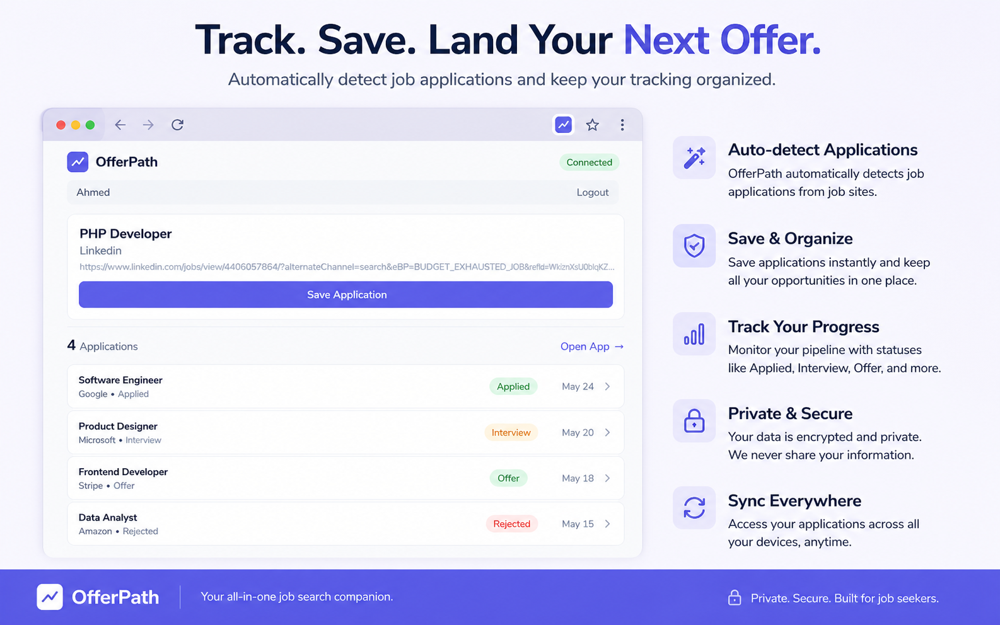
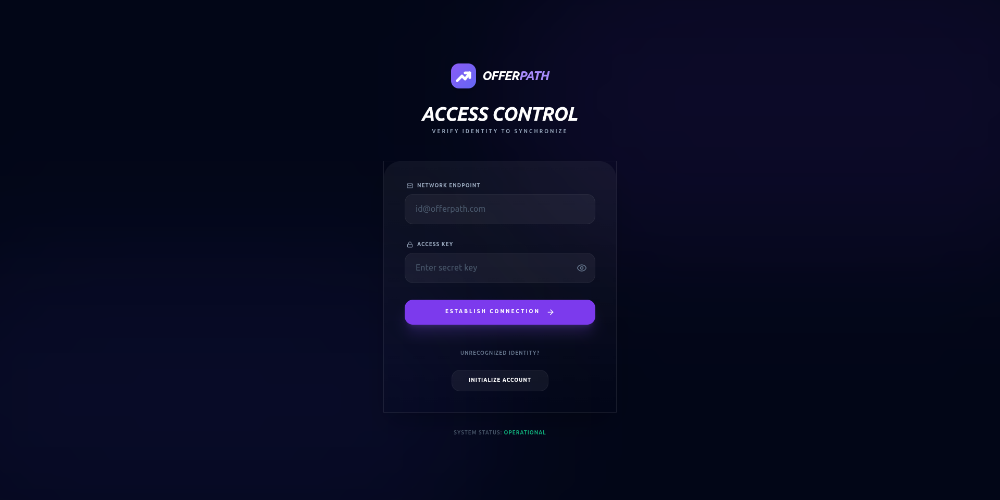
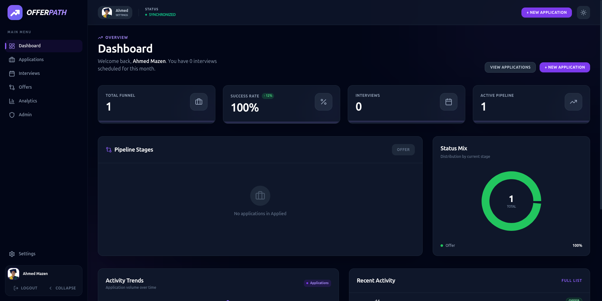
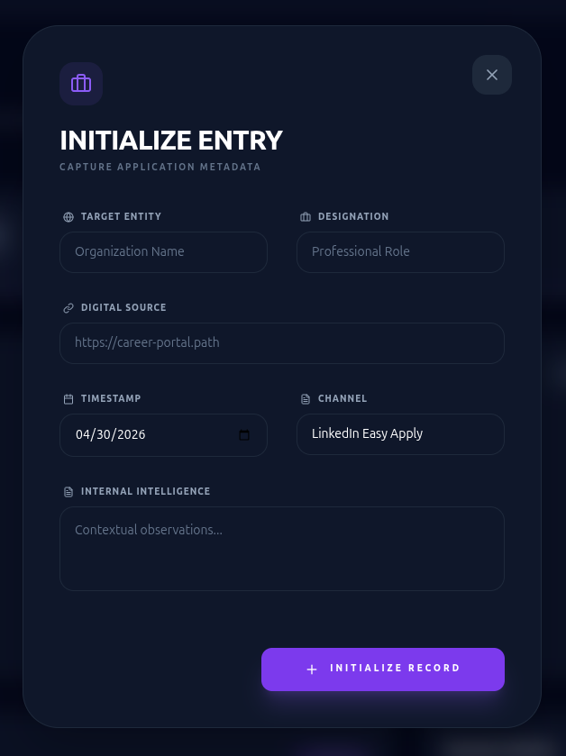

# OfferPath - Master Your Job Search 💼

  

## About The Project

**OfferPath** is a modern and comprehensive Job Application Tracker designed to empower job seekers. In a competitive market, keeping track of dozens of applications across different platforms can get overwhelming. OfferPath streamlines your entire job search process, allowing you to track your application statuses, upcoming interviews, and job offers efficiently.

Whether you're applying directly through company websites or tracking progress from LinkedIn or Indeed, OfferPath gives you a rich dashboard, deep analytics, and a seamless Chrome extension so you can log applications right from the browser. Never lose track of another opportunity again!

## 🧩 Chrome Extension

Log your job applications effortlessly while browsing the web!

🔗 **[Get the OfferPath Chrome Extension here](#)** *([Update with actual Chrome Web Store link once published](https://chromewebstore.google.com/detail/aghiahnclkjpcmdiebhpajhhbelndcmg?utm_source=item-share-cb))*

## 📸 Screenshots

Here is a glimpse of what OfferPath looks like:

### Log In / Sign Up
*Your secure entry point into the platform.*

### Dashboard Overview
*Your high-level metrics, upcoming interviews, and recent applications.*

### Adding a New Application
*Easily track a new opportunity with a few clicks.*

## ✨ Core Features

- 📊 **Unified Dashboard** - View all your applications, success rates, and quick stats in one place.
- 📋 **Application Management** - Searchable, filterable lists of all the roles you've applied to.
- 📝 **Detailed Pipeline Tracking** - Add notes, track specific hiring stages, and maintain a timeline.
- 📅 **Interview Scheduler** - Stay on top of your upcoming technical and cultural interviews.
- 💼 **Offer Comparison** - Evaluate compensation and benefits of competing offers side-by-side.
- 📈 **Funnel Analytics** - Understand your conversion rates from initial application to final offer.
- 🌐 **Browser Extension** - Add applications to your dashboard instantly via the companion Chrome Extension.

## 🛠️ Tech Stack & Architecture

OfferPath is built with a modern, scalable web stack:

- **Frontend**: React 19 + TypeScript + Vite + Tailwind CSS
- **Backend API**: FastAPI (Python)
- **Database**: Serverless PostgreSQL
- **Authentication**: JWT Based Auth

## 🚀 Deployment

The project is structured with separate deployments for frontend, backend, and database to ensure high performance and seamless scalability.

- **Frontend Hosted on Vercel**: Vercel handles our React app, providing extremely fast asset delivery, Edge caching, and a world-class CI/CD developer experience.
- **Backend Hosted on Hugging Face**: The FastAPI backend is deployed as a Hugging Face Space using Docker. It processes all business logic and API requests efficiently.
- **Database Hosted on Neon**: We utilize Neon for a serverless, highly-available Postgres database, ensuring rapid scaling, reliable data storage, and zero unneeded downtime.

### Setup & Environment Variables

**Backend (Hugging Face Spaces):**
1. Ensure you have set the following environment variables in your Hugging Face space configuration:
   - `DATABASE_URL` - Your Neon connection string
   - `SECRET_KEY` - Cryptographic key used for JWT encryption
   - `CORS_ORIGINS` - The URL of your Vercel frontend
2. *Tip: You can use the included `./deploy-hf.sh` script to independently deploy just the backend!*

**Frontend (Vercel):**
1. Link your GitHub repository to Vercel.
2. Specify the Root Directory as `frontend`.
3. Provide the environment variable:
   - `VITE_API_URL` = Your Hugging Face Space backend URL